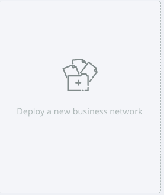
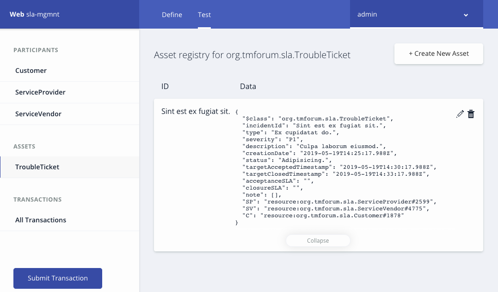

# SLA (Service Level Agreement) Management/Monitoring Network

> This is a distributed service level agreement (SLA) monitoring implemented using Hyperledger Composer. The monitoring system works in a trustless manner where none of the participants need to trust one another. This is a working proof of concept application under development by the [Hyperledger Telecom Special Interest Group](https://wiki.hyperledger.org/display/TCSIG/Telecom+SIG). 

# Implementation Option 1:
Using the Online (or local) [Composer Playground](https://composer-playground.mybluemix.net)
[Video tutorial for Hyperledger Composer Playground](https://www.youtube.com/watch?v=4ch9j4lZFmw)

1- Open [Composer Playground](https://composer-playground.mybluemix.net) in your browser.
2- Click on 'Deploy New Business Network':



3- Choose 'Drop here to upload or browse' and upload the .bna file.


4- Give the network admin card that will be created a name e.g., admin@sla-network and deploy.


5- Press 'Connect Now' and you can connect to the SLA monitoring POC:


# Implementation Option 2:
Deploying the .bna file direcly on you network.

1- Follow the steps in this tutorial: [Installing the development environment](https://hyperledger.github.io/composer/v0.19/installing/development-tools)
2- Follow the steps in the [Developer tutorial for creating a Hyperledger Composer solution](https://hyperledger.github.io/composer/v0.19/tutorials/developer-tutorial.html) and replace the SLA-Network BNA file with the tutorial-network BNA file. Then you can generate the Angular app and communicate with the network.


This business network defines:

**Roles:**
`Originator` `ServiceProvider` `Vendor`

```
enum Role {
  o Originator
  o ServiceProvider
  o Vendor
}
```

**Participants:**
`ServiceProvider ` `ServiceVendor ` `Customer `


```
participant ServiceProvider identified by providerId {
  o String providerId
  o String name
}

participant ServiceVendor identified by vendorId {
  o String vendorId
  o String name
}

participant Customer identified by custId {
  o String custId
  o String name
}
```

**Assets:**
`TroubleTicket `

```
asset TroubleTicket identified by incidentId {
  o String incidentId
  o String vendorTicketId optional
  o String type
  o Severity severity
  o String description
  o DateTime creationDate
  o String status
  o DateTime acknowledgedDate optional
  o DateTime resolutionDate optional
  o DateTime targetAcceptedTimestamp optional
  o DateTime targetClosedTimestamp optional
  o String acceptanceSLA optional
  o String closureSLA optional
  o Note[] note optional
  -->ServiceProvider SP
  -->ServiceVendor SV optional
  -->Customer C
}

```

**Transactions:**
`CreateTicket ` `AssignVendor ` `UpdateTicket ` `ResolveTicket ` `CloseTicket `


```
transaction CreateTicket{
  --> Customer C
  --> ServiceProvider SP
  --> ServiceVendor SV
  o String incidentId
  o String type
  o Severity severity
  o String description
  o DateTime creationDate
  o String status
  }

transaction AssignVendor{
  --> TroubleTicket ticket
  -->ServiceVendor SV
  o String status
  o DateTime statusChangeDate
  o String statusChangeReason
}

transaction UpdateTicket{
  --> TroubleTicket ticket
  o String status
  o DateTime statusChangeDate
  o String statusChangeReason
}

transaction ResolveTicket{
  --> TroubleTicket ticket
  o String status
  o DateTime resolutionDate
  o String statusChangeReason
}


transaction CloseTicket{
  --> TroubleTicket ticket
  o String status
  o DateTime statusChangeDate
  o String statusChangeReason
}
```


# Testing:
To test this Business Network Definition in the **Test** tab on the playground or in your Angular app:

1- In the `Customer`, `ServiceProvider`, `ServiceVendor` participant registry, create new participants with appropriate input values.

Alternatvely, you can also use the `SetupDemo` tranaction which would populate the network with 2xCustomers, 2xServiceProviders, 2xServiceVendors.

2- Creat a ticket using the `Submit Transaction` button and fill in the information based on the created participants. Uppon submission, you should see a new asset added to the assel lists under 'TroubleTicket'.



3- Try the other transaction in a simmilar manner.


**ToDo:** Create a SetupDemo transaction to populate the network.

Congratulations!

## License <a name="license"></a>
Hyperledger Project source code files are made available under the Apache License, Version 2.0 (Apache-2.0), located in the LICENSE file. Hyperledger Project documentation files are made available under the Creative Commons Attribution 4.0 International License (CC-BY-4.0), available at http://creativecommons.org/licenses/by/4.0/.


