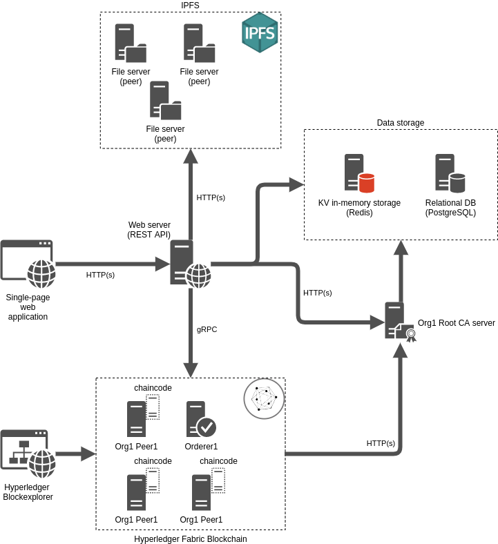

# Lab Name 
[Electrodo.Docs](https://github.com/hyperledger-labs/Electrodo.Docs)

# Short Description 

Electrodo is a Web3 platform for ESG data, asset, and risk management, helping companies and investors create sustainable value and improve the efficiency of sustainable capital allocation. By addressing ESG data availability, integrity, and reliability issues, Electrodo streamlines the ESG asset management, such as tokenized clean energy, carbon emissions, carbon credits, ESG stocks (shares),  etc.
Electrodo digitizes and automates the collection, processing, verification, and sharing (disclosure) of financially material ESG data between the double-pole stakeholders (industrial producer and investor) value chain by obtaining and processing data from various sources with data notarization and verification on a blockchain.

Electrodo solves the problem of ESG data availability, completeness, integrity, and reliability for ESG (climate-related) data and risk management, as well as contributes to the resilience and sustainability of the industrial value chain. Using our solution, industrial companies can collect and manage ESG data, and as a result, identify, assess, and manage ESG (climate-related) risks, thus implementing an ESG strategy to mitigate disruptive climate changes.

Moreover, SMEs can set their own ESG impact targets and follow up on their progress, where those targets and progress measures may also be accessed by investors, asset managers, or private equity funds interested in investing and allocating capital in those sustainable businesses. This demonstrates the understanding and ability to effectively manage a business with a simultaneous positive impact on ESG factors.

# Scope of Lab 
In Hyperledger Labs, we develop an Electrodo.Docs (Fig. 1) - document management service of Electrodo platform.

Electrodo.Docs is a document management service designed for Electrodo platform users. Integrated with technologies such as Hyperledger Fabric and IPFS protocol, this service enhances the ESG/Sustainability disclosure process, ensuring transparency, security, and ease of management throughout the reporting lifecycle.

# Key Features & Functionalities.

### ESG Document (Data/Context) Management.

With the rapidly evolving ESG landscape, the need for a streamlined, organized, and secure document management system. Electrodo.Docs offers a platform where users can efficiently manage their ESG-related documents. This includes storing, retrieving, updating, and archiving vital records, ensuring that data remains consistent, accurate, and easily accessible.

### Document Notarization with Blockchain/IPFS.

One of the standout features of Electrodo.Docs is its ability to notarize documents. By leveraging the decentralized capabilities of blockchain and the InterPlanetary File System (IPFS) protocol, the service ensures that every document's authenticity is verifiable. When a document is uploaded, a unique cryptographic hash is generated and stored on the blockchain, while the document itself resides on IPFS. This ensures that the document remains tamper-proof, providing an additional layer of security and trust.

### Self-Verification Services.

In the digital economy, the ability to verify the authenticity of documents independently is crucial. Electrodo.Docs offers a self-verification service, allowing stakeholders to confirm the integrity and authenticity of any document stored within the system. By comparing the cryptographic hash of the document with the one stored on the blockchain, users can ensure that the document hasn't been altered since its notarization.

### Decision-Making with a Voting Mechanism.

Collaborative decision-making is pivotal in ESG/Sustainability reporting. Electrodo.Docs incorporates a sophisticated voting mechanism, facilitating consensus-driven decision-making. Stakeholders can propose changes in ESG strategy, and through a transparent and democratic voting process, the most supported decisions get implemented, ensuring collective agreement and collaboration.

# Initial Committers 

https://github.com/bismerk

https://github.com/andrii482

https://github.com/alexshehovcov

https://github.com/Dmitrii-Kholodov

https://github.com/roman-kravchenko

# Sponsor 
482.solutions is a Singapore-based international company with headquarter in Ukraine, specializing in the development of industrial Web3 and blockchain-based solutions for the Green Energy, Green Finance, and Sustainable Value Chain sectors.

# Pre-existing repository 
https://github.com/482solutions/ElectrodoDoc-meta
