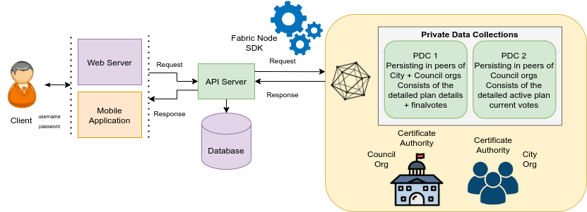
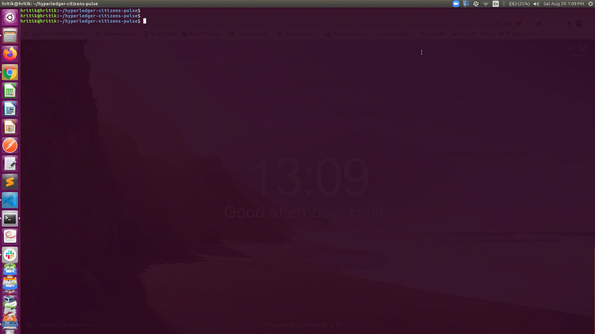
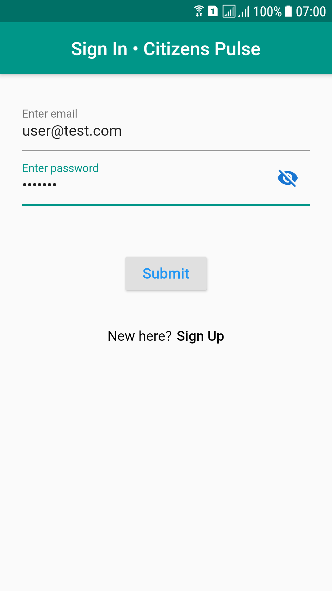
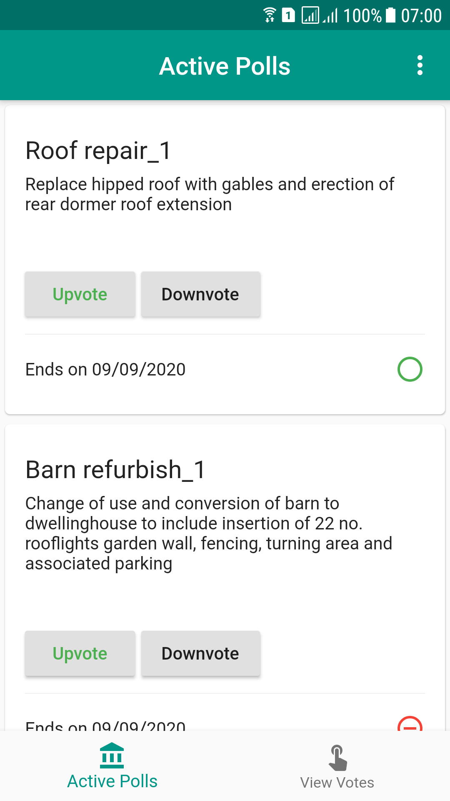

# Lab Name
[Citizens Pulse](https://github.com/hyperledger-labs/citizens-pulse)

# Short Description

A fully distributed platform for state/city councils to know, share and feel the interests, pulse of citizens on their decisions. This is implemented with Hyperledger Fabric.

# Scope of Lab

## Introduction and Problem Statement

Many city councils want to know the voice of citizens whenever a change is implemented. Usually when a city approves a plan, there is always a small minority affected/opposing it. The city always wants feedback from the citizens on their decisions and they never have a proper channel to do so. Though the usage of online forums are common in developed and developing countries, it is usually challenging to get public agree on a common platform as the platforms are controlled by individual companies, government bodies etc. Also, public is worried about their privacy and safety of the platform. Further, there are also situations like some NGOs who host the platform have financial challenges and hence forced to discontinue their services.

## Proposed Solution

In a distributed platform like Hyperledger Fabric, its possible to decentralize the ownership. This gets to a situation where the platform is by the people and for the people. Also, due to the immutable nature of Hyperledger Fabric, there is one source of truth existing in the system. The endorsement policies handle the privacy part and Certificate-Authorities provide safe and secure platform. When the Hyperledger Fabric components are shared among the NGOs/government/Universities/private-bodies, the ownership is distributed.

## Architecture:

### Orderers and Peers:

Orderers and Peers are distributed and hosted across government, NGOs and private bodies.

### Endorsement policy:

Combination of Private data implicit collections/Key-level endorsement policies are implemented.

### Overview

## High-level workflow:

1. Automatic enrollment with bank identification, some other reliable systems through CA or other means
2. Add/modify/delete opinions and votes. Note that after the voting/poll has ended, the results get public and saved in blockchain.

## Demo

## Installations & Bringing the Project Up

## Web User Interface

## Mobile Interface

  

# Initial Committers

- [Hritik Gupta](https://github.com/hritikgupta)
- [Anoop Vijayan Maniankara](https://github.com/maniankara)

# Sponsor

[Vipin Bharathan](vipinsun@gmail.com) - Chair of the Identity Working Group

# Pre-existing repository

- [Hyperledger Citizens Pulse](https://github.com/maniankara/hyperledger-citizens-pulse) - **Private repository**

## This is an extention project from Hyperledger Mentorship Program 2020.

- Mentorship Project proposal - https://wiki.hyperledger.org/pages/viewpage.action?pageId=29036032
- Mentorship Project plan - https://wiki.hyperledger.org/pages/viewpage.action?pageId=31202438
