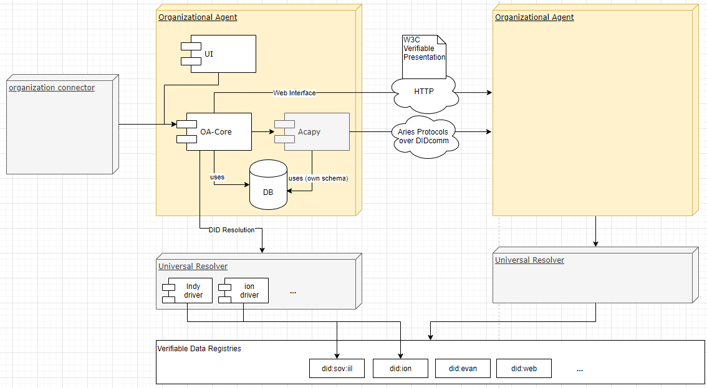

# Lab Name
Organizational Agent

# Short Description
The Organizational Agent allows to manage and exchange master data between organizations.

# Scope of Lab
The Organizational Agent is a domain-specific controller and extension for Aries Cloud Agent Python. It allows to manage and to publish public organizational master data tied to a decentralized identifier (DID) as well as to share and to request business partner specific master data and certifications.

The project consists of a backend written in Java that provides domain-specific APIs for integration in enterprise systems, as well as a simple reference user interface.

# Initial Committers
- https://github.com/etschelp
- https://github.com/frank-bee
- https://github.com/domwoe

# Sponsor
- https://github.com/swcurran Co-Chair of the Aries Working Group
