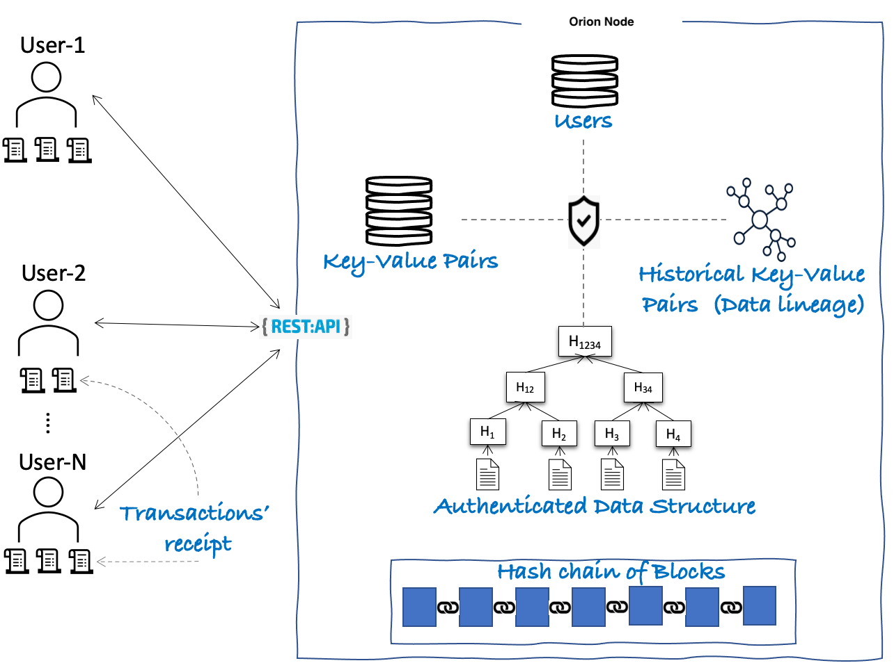

# Lab Name

[Orion](https://github.com/hyperledger-labs/orion-server)

* [orion-sdk-go](https://github.com/hyperledger-labs/orion-sdk-go)

# Short Description

Orion is a centralized ledger with certain blockchain properties such as tamper-evident, and non-repudiation.

# Scope of Lab

Orion resembles a document database with the following blockchain properties

  - **Tamper-Evident**: Data cannot be tampered with, without it going unnoticed. At any point in time, a user can request an Orion node to provide proof for the existence of a transaction or data and verify the same to ensure data integrity.
  - **Non-Repudiation**: A user who submitted a transaction to make changes to data cannot deny submitting the transaction later.
  - **Crypto-based Authentication**: A user that submitted a query or transaction is always authenticated using a digital signature.
  - **Confidentiality and Access Control**: Each data item can have an access control list (ACL) to dictate which users can read from it and which users can write to it. Each user needs to authenticate themselves by providing their digital signature to read or write to data. Depending on the access rule defined for data, sometimes more than one users need to authenticate themselves together to read or write to data.
  - **Serialization Isolation Level**: It ensures a safe and consistent transaction execution.
  - **Provenance Queries**: All historical changes to the data are maintained separately in a persisted graph data structure so that a user can execute a query on those historical changes to understand the lineage of each data item.

Orion **DOES NOT** have the following two blockchain properties:

  - **Smart-Contracts**: A set of functions that manage data on the blockchain ledger. Transactions are invocations of one or more smart contract's functions.
  - **Decentralization of Trust**: A permissioned setup of known but untrusted organizations each operating their own independent database nodes but connected together to form a blockchain network. As one node cannot trust the execution results of another node, ordering transactions must be done with a BFT protocol
  and all transactions need to be independently executed on all nodes.

Figure 1 presents the high level architecture of Orion.

Orion stores and manages the following five data elements:

  1. **Users**: Storage of users' credentials such as digital certificate and their privileges. Only these users can access the Orion node.
  2. **Key-Value Pairs**: Storage of all current/active key-value pairs committed by users of Orion node.
  3. **Historical Key-Value Pairs**: Storage of all past/inactive key-value pairs using a graph data structure with additional metadata
  such as the user who modified the key-value pair, all previous and next values of the key, transactions which have read or written to
  the key-value pair, etc... It helps to provide a complete data lineage.
  4. **Authenticated Data Structure**: Storage of Merkle Patricia Tree where leaf node is nothing but a key-value pair. It helps in
  creating proofs for the existence of a key-value pair.
  5. **Hash chain of blocks**: Storage of cryptographically linked blocks, where each block holds a set of transactions submitted
  by the user along with its commit status, a summary of state changes in the form of Merkle Patricia's Root hash, etc... It helps in
  creating a proof for the existence of a block or a transaction.

The users of the Orion node can query these five data elements provided that they have the required privileges and
also can perform transactions to modify active key-value pairs. When a user submits a transaction, the user receives a transaction receipt
from the Orion node after the commit of a block that includes the transaction. The user can then store the receipt locally for performing
client-side verification of proof of the existence of a key-value pair or a transaction or a block.

# Initial Committers

- https://github.com/cendhu
- https://github.com/tock-ibm
- https://github.com/gennadylaventman
- https://github.com/C0rWin
- https://github.com/dany-moshkovich

# Sponsor

- https://github.com/cendhu - Hyperledger Fabric Maintainer
- https://github.com/C0rWin - Hyperledger Fabric Maintainer

# Pre-existing repository

- https://github.com/IBM-Blockchain/bcdb-server
- https://github.com/IBM-Blockchain/bcdb-sdk
